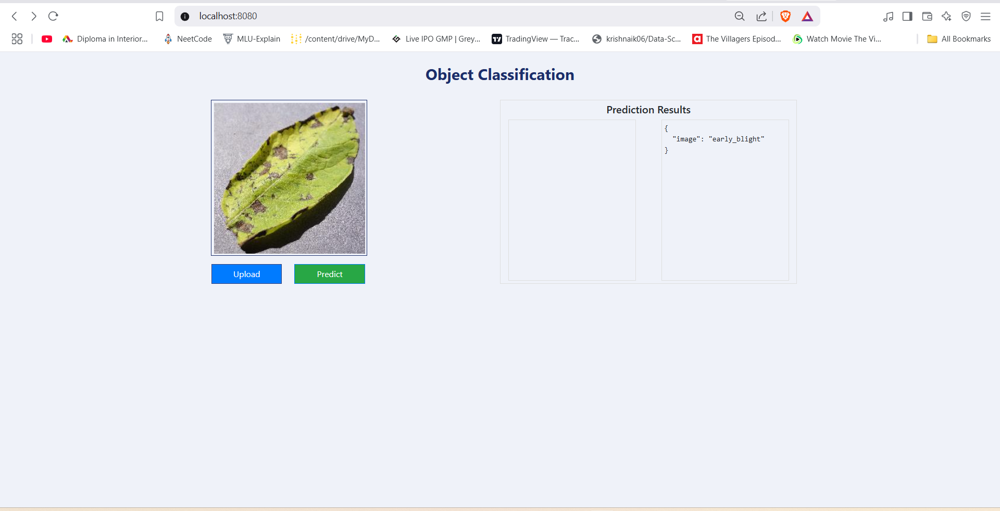

# 🍃 Potato Leaf Disease Classification

An end-to-end deep learning project for classifying potato plant leaf images into **Healthy** or **Diseased** categories.  
This project demonstrates **computer vision expertise**, **model deployment**, and **cloud-ready architecture** for agricultural AI solutions.

---

## 🚀 Project Overview

Potato crops are highly susceptible to fungal and bacterial infections. Early detection of leaf diseases helps farmers reduce crop loss and optimize pesticide usage.  
This project leverages **Convolutional Neural Networks (CNNs)** to classify potato leaf images with **97.68% accuracy**.

Key Features:
- 📂 **Image Classification** using CNN (trained from scratch, no pre-trained models)
- 🖼️ **Image Augmentation** to improve model generalization
- 🔍 Real-time **disease detection** with uploaded images
- 🌐 **User-friendly web app** built with Flask
- ☁️ **Production-ready architecture** (Dockerized & deployable on AWS/AZURE)

---

## 📊 Evaluation Metrics

| Metric     | Value        |
|------------|-------------|
| **Loss**   | 0.1186       |
| **Accuracy** | 97.68%      |

---

## 🛠️ Tech Stack

| Component        | Technology Used |
|------------------|----------------|
| **Programming Language** | Python 3.10 |
| **Deep Learning Framework** | TensorFlow / Keras |
| **Model Type**    | Convolutional Neural Network (CNN) |
| **Data Augmentation** | `ImageDataGenerator` |
| **Frontend/Backend** | Flask |
| **Deployment**    | Docker, AWS-ready,AZURE-ready |
| **Visualization** | Matplotlib, Seaborn |
| **Version Control** | GitHub |

---

## 📂 Dataset

- Sourced from publicly available agricultural image datasets
- Images organized in **2 classes**:
  - `Potato___Early_blight`
  - `Potato___Healthy`
- Training, validation, and testing splits applied

---

## 🔑 Features

- End-to-end ML pipeline: **data preprocessing → model training → evaluation → deployment**
- **Real-time predictions** via web interface
- High accuracy achieved **without transfer learning**
- Modular code design for scalability

---

## 🌐 Project Architecture

- Dataset → Data Preprocessing → CNN Model → Training & Validation → Web App → Docker/AWS Deployment/AZURE Deployment


---

## 🖼️ Project Demo

Below are sample screenshots of the web app in action:

| Homepage | Prediction_healthy | Prediction_early_blight |
|----------|-------------------|-------------------|
|  |  |  |


---

## 🖥️ How to Run Locally

1. Clone this repository:
   ```bash
   git clone https://github.com/kartheek2003/potato-disease-class.git
   cd potato-disease-class

2. Install dependencies:
   ```bash
    pip install -r requirements.txt
   
3. Run the Flask app:
   ```bash
    python app.py

4. Access the web app at:
   http://127.0.0.1:8000

5. Train the model first :
   http://127.0.0.1:8000/train

6. predict :
   http://127.0.0.1:8000

 upload the input image or any image of ur choice and predict 


## 🔮 Future Improvements

- Integrate **Transfer Learning** for faster training  
- Build **mobile app deployment** for offline predictions  
- Use **MLOps pipeline** for continuous monitoring and updates  
